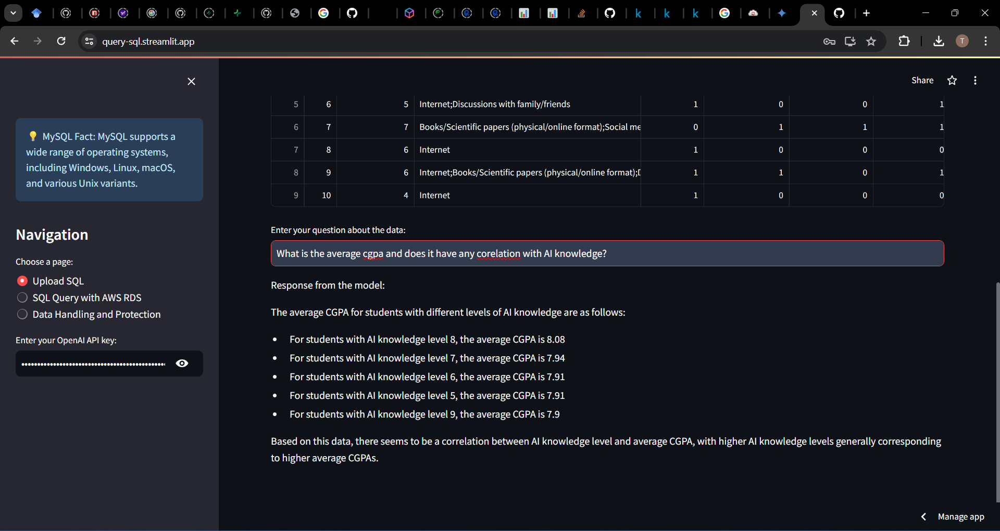
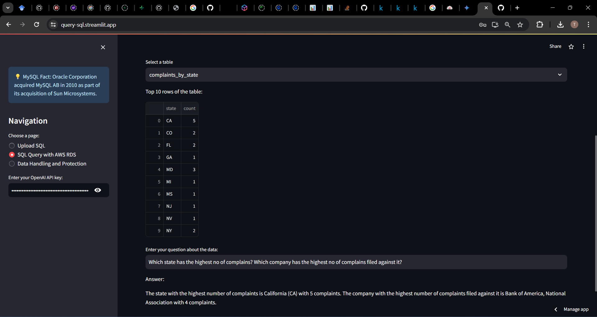

# Interactive SQL Query Application 🚀  

https://query-sql.streamlit.app/  

This Streamlit application allows users to interact with SQL databases in an intuitive and user-friendly way. The application provides the ability to upload a SQLite database file or connect to an AWS RDS MySQL database, execute queries, and get responses using OpenAI's GPT-3.5 model.

## Features

1. **Upload and Query SQLite Database**:
    - Upload a SQLite database file (`.db`).
    - Select a table from the uploaded database.
    - Display the top 10 rows of the selected table.
    - Ask questions about the data using natural language queries.

2. **Connect and Query AWS RDS MySQL Database**:
    - Input credentials for your AWS RDS MySQL database.
    - Select a table from the connected database.
    - Display the top 10 rows of the selected table.
    - Ask questions about the data using natural language queries.

3. **Data Handling and Protection**:
    - Detailed information on how data is encrypted and protected within the application.
    - Tips on additional security measures for safe data handling.

4. **Random MySQL Facts**:
    - Display a random fact about MySQL each time the application is loaded, providing interesting insights about MySQL.

## Screenshots

### Upload and Query SQLite Database


### Connect and Query AWS RDS MySQL Database


## Installation

1. **Clone the repository**:
    ```sh
    git clone https://github.com/Tar-ive/sql_query_app.git
    cd sql_query_app
    ```

2. **Create a virtual environment and activate it**:
    ```sh
    python -m venv venv
    source venv/bin/activate  # On Windows use `venv\Scripts\activate`
    ```

3. **Install the dependencies**:
    ```sh
    pip install -r requirements.txt
    ```

4. **Run the application**:
    ```sh
    streamlit run app.py
    ```

## Usage

1. **API Key**:
    - Enter your OpenAI API key in the sidebar to enable query functionalities.

2. **Navigate through the pages**:
    - **Upload SQL**: Upload a SQLite database file, select a table, view the top 10 rows, and ask questions about the data.
    - **SQL Query with AWS RDS**: Enter AWS RDS credentials, select a table, view the top 10 rows, and ask questions about the data.
    - **Data Handling and Protection**: Learn about the security measures taken to protect your data.

## Contributing

Feel free to submit issues or pull requests if you have suggestions or improvements.

## License

This project is licensed under the MIT License.

## Contact

For any inquiries, please contact [adhsaksham27@gmail.com].

---

**Enjoy querying your databases interactively with this app!** 🚀
